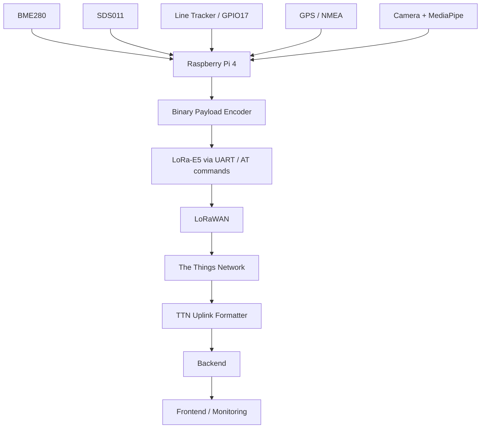

# Architecture

## Sensor-station role

The Smarti sensor station is the edge component responsible for acquiring real-world data and transmitting compact measurements into the Smarti platform.

## Responsibilities

The Raspberry Pi acts as the local controller. It:

- reads environmental and particulate-matter sensors,
- obtains the current GPS position,
- reads the digital line-tracker state,
- consumes locally produced traffic counts,
- stores a persistent station identity,
- encodes login and measurement messages,
- controls the LoRaWAN module through serial AT commands,
- transmits uplinks to The Things Network.

The design intentionally sends compact values rather than images. Camera frames are processed locally and only the resulting counters are forwarded.

## Interfaces

| Component | Interface | Purpose |
|---|---|---|
| BME280 | I²C | Temperature and humidity |
| SDS011 | UART / serial | PM2.5 and PM10 |
| GPS module | UART / serial | NMEA position data |
| Line tracker | GPIO17 | Digital status |
| Camera Module 3 Wide | CSI / libcamera | Local object detection |
| LoRa-E5 | UART / serial | LoRaWAN AT-command communication |
